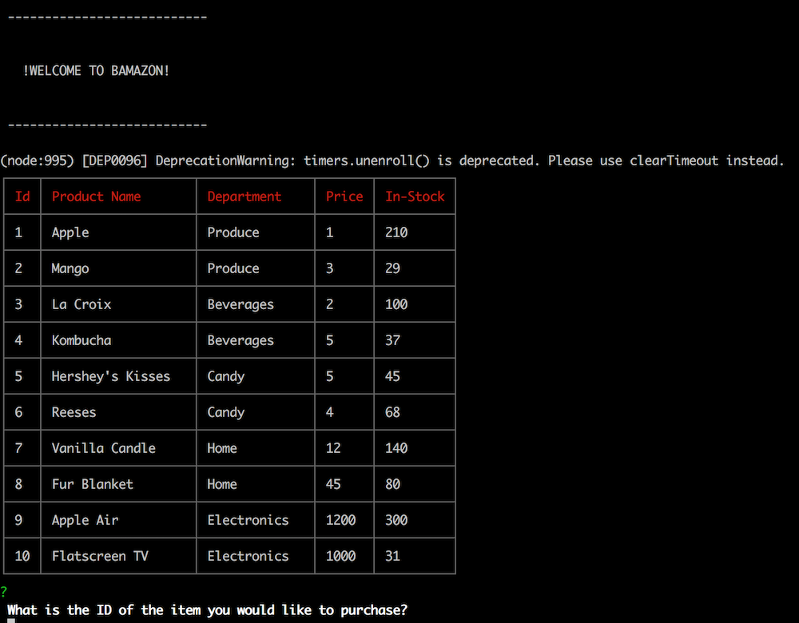

# Bamazon 🛍️
'Shopping' with mySQL.

This is an app that takes in orders from customers and deletes stock from the current inventory.
Runs through node.js, with connection to mySQL.

In order to run this application, be sure to install the npm packages listed:
* inquirer
* mysql
* cli-table2

# Git ignore ⚠️
Git ignore has been added to avoid uploading the node_modules that have been auto
downloaded with the json packages. This makes it so you won't overload your github with
extra files - slowing it down and taking up memory.

## Built With

* [node.js]
* [mySQL]
* [JavaScript]




## Sample of Code

Below I created a new table, adding it to the constructor function so I am able to display
the results from the MySQL table I created.

```
var table = new Table({
  head: ['Id', 'Product Name', 'Department','Price', 'In-Stock'],
  colWidths: [4, 20, 15, 7, 10]
});

for (var i = 0; i < response.length; i++) {
  table.push([response[i].item_id, response[i].product_name, response[i].department_name,  response[i].price, response[i].stock_quantity]);
};

```


## Authors

* **Lena Martinson** - [Blonded](https://github.com/Blonded)
* **Sasha** - [Sasha Patsel](https://github.com/sashapatsel)

## Resources
* **sql - npm** - [sql cli-table](https://www.npmjs.com/package/cli-table2)
